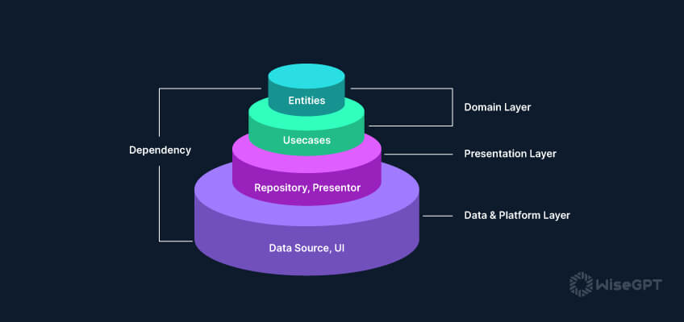

## Clean Architecture

Clean Architecture is a design pattern that emphasizes separation of concerns and maintains a clear boundary between different parts of an application. For a detailed description of Clean Architecture and its principles, please refer to the [Clean Architecture Documentation](https://example.com/clean-architecture-details).

### Clean Architecture Data Flow

In Clean Architecture, data flows between layers in a unidirectional manner, ensuring a clear separation of concerns and maintaining the integrity of the application’s core business logic. The flow of data is orchestrated in the following sequence:

1. **User Interface (UI)**: 
   - The user interacts with the UI, triggering a request that typically initiates in a controller or a view model.

2. **Use Cases (Application Layer)**: 
   - The UI forwards the user’s request to a use case. The use case represents a specific application feature or action (e.g., creating, reading, updating, or deleting a product).
   - The use case coordinates the execution of the business logic by interacting with the relevant entities and repositories.

3. **Repositories (Interface Layer)**: 
   - The use case communicates with the repository to retrieve or persist data.
   - The repository abstracts the details of the data source (e.g., API, database) and provides data to the use case.

4. **Entities (Domain Layer)**: 
   - Entities represent the core business models of the application. They are used by the use cases to perform the business logic.
   - The use case may modify these entities or create new ones based on the data it retrieves or processes.

5. **Data Sources (External Systems)**: 
   - Repositories fetch data from or save data to external systems like databases, APIs, or local storage.
   - The data retrieved is often mapped into domain entities or models before being passed back up the layers.

6. **Response Flow**:
   - The data, once processed by the use case and possibly modified, is returned back up to the UI layer.
   - The UI then displays the processed data to the user or responds to the user’s action accordingly.

### Clean Architecture Data Flow Diagram





## Tasks Overview

| **Task**                             | **Description**                                                                                                         |
|--------------------------------------|-------------------------------------------------------------------------------------------------------------------------|
| **Project Setup**                    | Initialized the Flutter project and set up TDD and Clean Architecture structure.                                         |
| **Product Entities**                 | Defined the `Product` entity in the domain layer, which includes attributes like `id`, `name`, `category`, `description`, and `price`. |
| **Use Cases**                        | Implemented use cases for inserting, updating, deleting, and getting products.                                           |
| **Repositories**                     | Defined repository interfaces for managing product data. Implemented the repository using local data sources.            |
| **Product Model**                    | Created the `ProductModel` class for JSON serialization, including `toJson` and `fromJson` methods.                      |
| **Testing**                          | Wrote unit tests for product use cases and models using `mockito`.                                                       |

## Folder Structure

| **Path**                             | **Description**                                                                                                         |
|--------------------------------------|-------------------------------------------------------------------------------------------------------------------------|
| `lib/core/`                          | Contains core utilities and error handling (e.g., `failure.dart`, `database_failure.dart`, `server_failure.dart`).       |
| `lib/features/product/domain/`       | Holds the domain logic, including entities, use cases, and repository interfaces.                                        |
| `lib/features/product/data/`         | Contains data models and repository implementations.                                                                    |
| `test/features/product/domain/`      | Includes tests for domain layer use cases (`get_product_test.dart`, `delete_product_test.dart`).                         |
| `test/features/product/data/`        | Contains tests for data models and repository implementations.                                                          |

## Packages Used

| **Package**                                | **Description**                                                                                                         |
|--------------------------------------------|-------------------------------------------------------------------------------------------------------------------------|
| **[equatable](https://pub.dev/packages/equatable)** | Simplifies value equality comparisons in Dart.                                                            |
| **[dartz](https://pub.dev/packages/dartz)**         | Provides functional programming constructs like `Either`.                                                    |
| **[mockito](https://pub.dev/packages/mockito)**     | A Dart package for creating mocks in unit tests.                                                            |
| **[build_runner](https://pub.dev/packages/build_runner)** | A build system for Dart code generation.                                                            |

## Installation

To install dependencies, add the following to your `pubspec.yaml` file:

```yaml
dependencies:
  flutter:
    sdk: flutter
  equatable: ^2.0.0
  dartz: ^0.10.1

dev_dependencies:
  mockito: ^5.1.0
  build_runner: ^2.1.7
